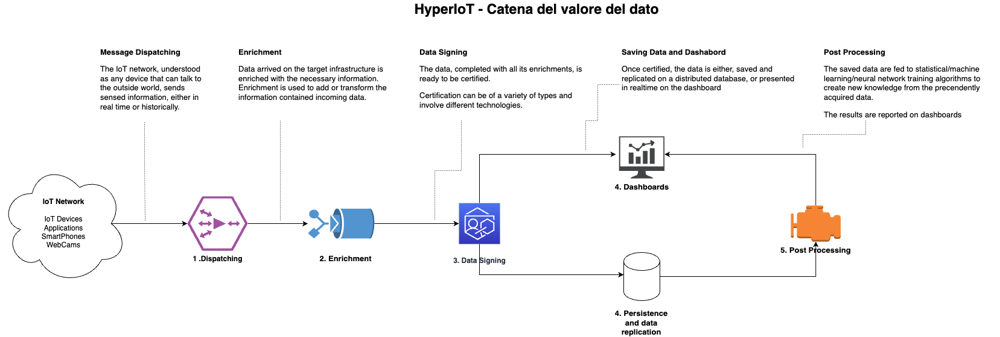
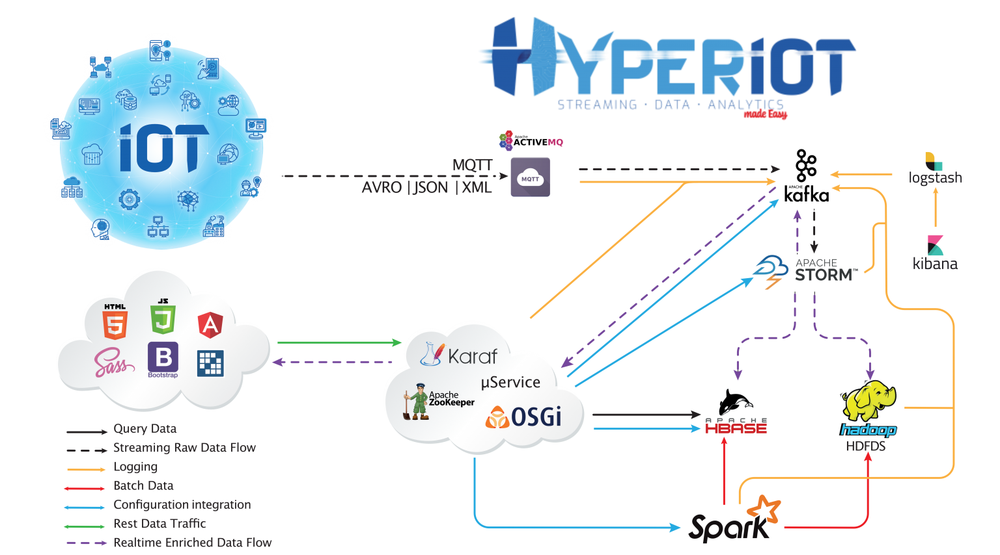

# HyperIoT Framework

# Summary

- [What is HyperIoT ?](#what-is-hyperiot-?)
- [Core Concepts](#core-concepts)
- [Architecture](#architecture)
- [Getting Started](#getting-started)

# What is HyperIoT ?

<b>HyperIoT</b> is an OpenSource, Cloud Native platform based on Apache Technologies for managing big data from any IoT network (Both software, such as applications that can send data, and hardware, such as sensors for Industry 4.0).
The platform captures the information sent from any source by managing data compression, running statistics or machine/deep learning algorithms, presenting data to the end user in realtime and offline mode (saved data).

It consists of the following macro-components (all Apache Technologies):

- Realtime and Enrichments (Kafka and storm): Realtime configuration and visualization of data coming from sources with the possibility of defining enrichment rules on incoming data

- Events and Alarm Management (storm): Data are analyzed in realtime with the possibility of reporting any alarms by sending timely notifications either to the device or using other channels such as email

- Persistence (HBase and Hadoop) : Data is saved in a secure mode

- Statistics and Machine Learning (Apache Spark): It is possible to run periodically, on the saved data, machine learning algorithms or generic statistics presenting the results of these computations in the user's dashboard.

<b>HyperIoT</b> architecture constitutes a generic server-side architecture suitable for cross-cutting applications in various manufacturing sectors. The infrastructure allows a user, without the intervention of external developers, to be able to:

- Configure communication between the IoT network and the cloud (without writing code but following graphically guided processes)
- Have a set of predefined statistics for the data being processed
- Upload your own analytics algorithms (for more technical users)
- Access an intuitive web interface for configurations and access to real-time and historical data via different graphical widgets
- Share the information collected.

The easy use of the platform through graphically guided processes allows it to be used even by personnel who do not have specific knowledge about IoT topics, data streaming, big data, etc...
This will help spread the benefits of IoT and Industry 4.0 technologies even to personnel who are not exactly experts. There are currently other platforms (including Open Source) that aim to achieve the same results, below are the main ones identified with conclusions on the main differences.

<b>HyperIoT</b> main goal is not only to help companies to organize and collect their data , but to extract value from them.
We can simplify the whole process implemented by the platform in this simple diagram:

# Core Concepts

To implement the process described above HyperIoT defines some very simple concepts:

- Project: aggregator of self-consistent informations. Everything that exists within a project makes sense to exist only in that project. Data from different projects are not directly related

- Device: Entity (Device or Application) that can detect an information and send it towards the platform

- Packet: Information content sent from the Device toward the platform (one device can also send multiple packets)

- Enrichment: Data rule that allows information to be added to the input packet e.g. Tagging a piece of data that has characteristics or performing fourier transform on a set of input data

- Events: actions to be performed by the platform when certain conditions occur on the data. E.g. temperature > 60 then sends firefighting ignition command

- Alarm: A more evolved entity than an event where, an event is defined with associated severity

-Statistics: successive aggregations on the acquired data.

- Areas: logical aggregations of devices that can create subsets of the initial devices. For each defined area there is a dedicated dashboard. in this way use cases with many devices can be managed by separating them logically. Each area can have associated image , map or BIM models.

# Architecture

The overall architecture is presented below.
HyperIoT implements a Lambda Architecture i.e., the reference model for systems that have to manage Big Data.

Within the figure there are different interactions and paths for data: The path indicated with black colored arrows represents the realtime path.
The data starting from the IoT network reaches the infrastructure via mqtt containing packets inside either in Avro or JSON or XML format.

From the ActiveMQ broker, the raw data arrives inside Kafka. At this point the enrichment phase comes into play through which additional information is added to the packet and channeled to the persistence layer.
The speed view is represented by HBase, which will contain both the raw data and the enriched version. HBase could also represent the realtime connection point from where the presentation part can take the information and present it in realtime on the page.

The blue path, on the other hand, represents post-processing where scheduled batches provide periodic updates to the batch-views. In addition, the presentation part will be able to access the history of data sent through Apache Hive.

The communication in red represents the statistics algorithms that are applied by Spark to the raw data and are always inserted within the speed view. The interactions in green represent the rest integrations between the various layers of the platform.

Finally, the entire platform will have a logging system based on logstash and Kibana.

HyperIoT has a flexible structure that allows it to evolve from "lambda architecture" to the most modern Data Mesh concepts.
This structure represents only a base on top of which different layers can be created for data management in terms of both features and responsibilities.

# Getting Started

It is possible to run all the infrastructure through the docker composes in the source. 
Specifically in the "containers-src/compose" folder. In this folder there are different composes for testing the whole platform or parts of it. 
To run the whole infrastructure just run the docker-compose-svil-all.yml

All composes inherit from a base file docker-compose-svil-basic.yml where the versions of all containers used are defined with their environment variables.

Please verify that you create "data" folder inside the compose folder. Data folder structure should cotain the following folders:

-hadoop
-postgres
-storm

Then automatically each container will persist data to that path.

Containers and maven modules are located to:

docker: https://nexus.acsoftware.it/nexus/repository/acs-docker/
maven: https://nexus.acsoftware.it/nexus/repository/maven-hyperiot/

Both are public repos.

## Running Front end locally

TBD

## Running microservices locally

TBD

## Running MQTT Broker locally

TBD

## Deploy new services version

TBD

gradle newRelease -Dhyperiot.platform.version=X -Dkaraf.version=Y -Dhyperiot.version=Z